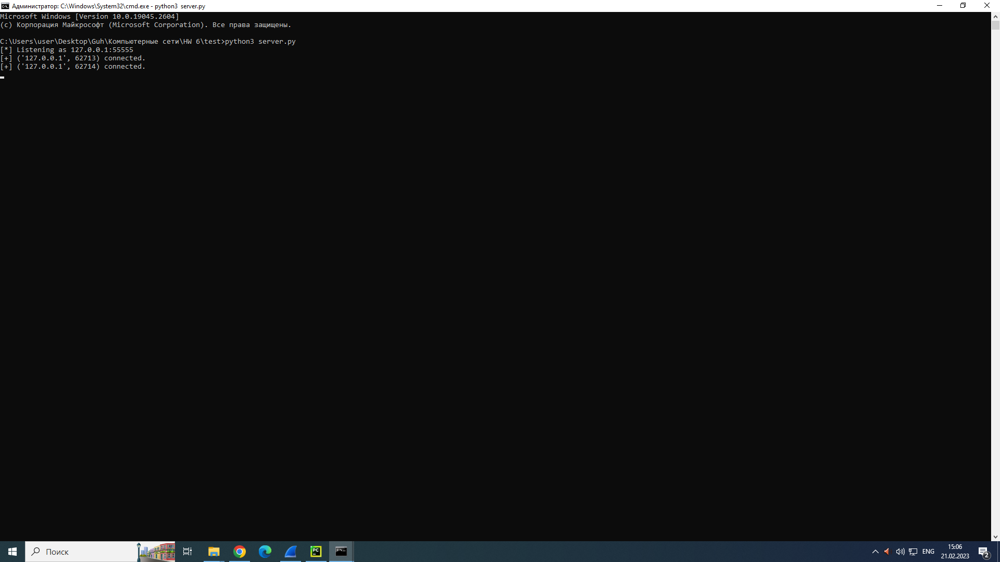
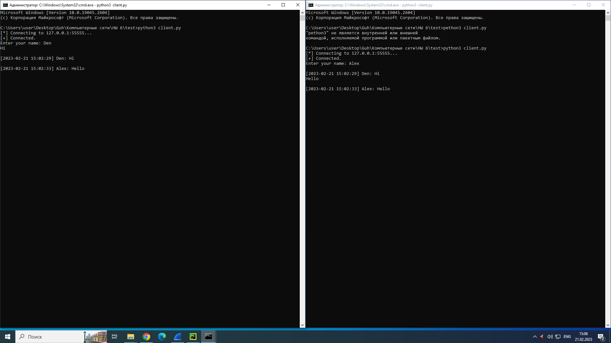
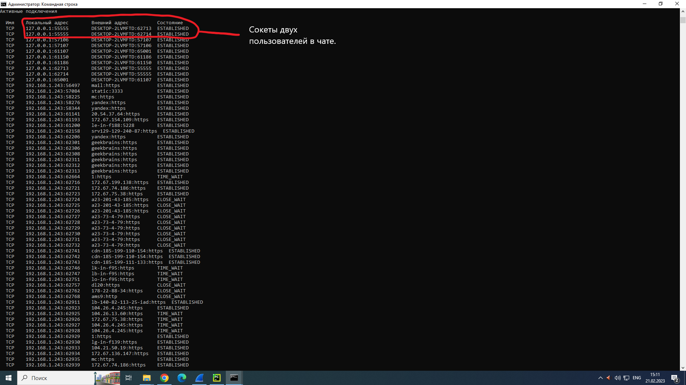

# Программа сервер с чатом.
## Скриншот работы сервера.

## Скриншот работы Чата.

Чтобы выйти из чата нужно напичатать команду ```q```
## Скриншот сокетов пользователей в чате с помощью команды ```netstat```.

